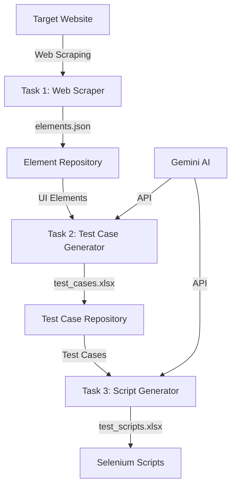
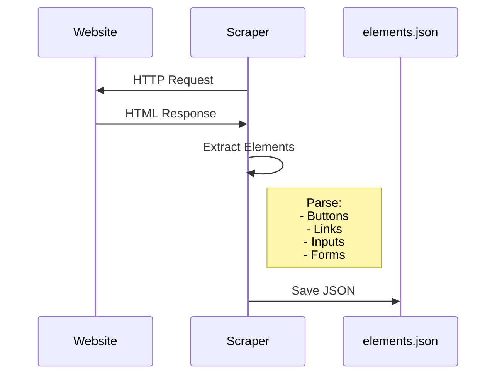
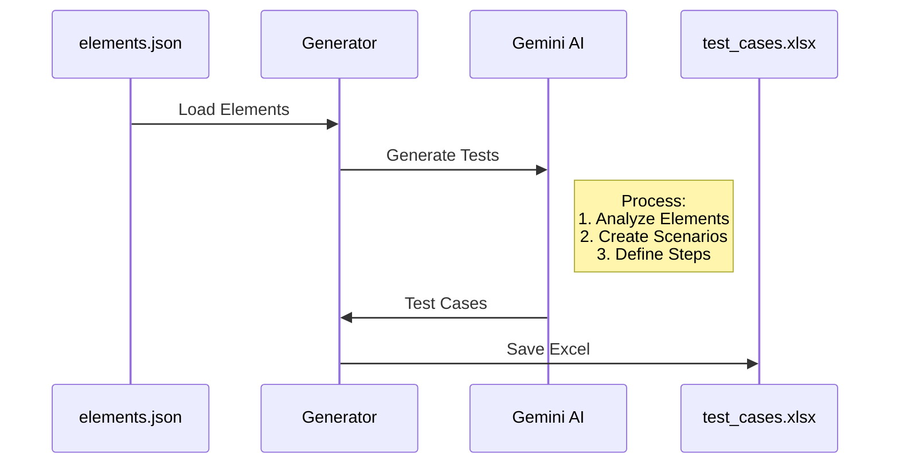
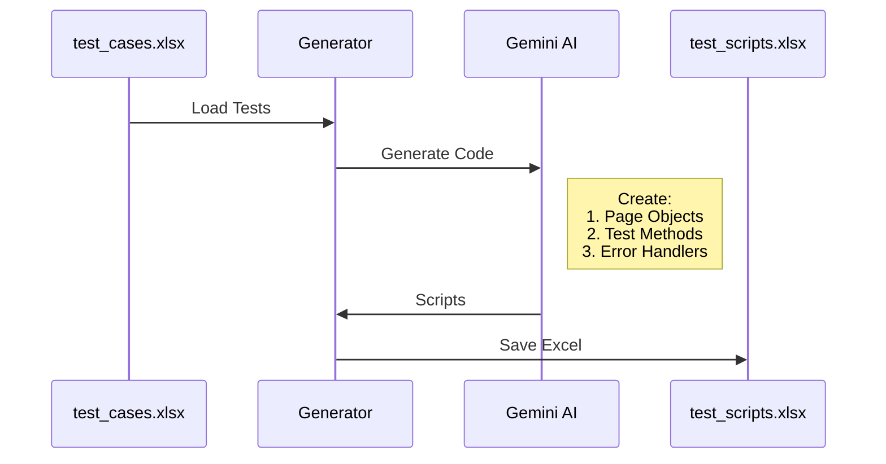
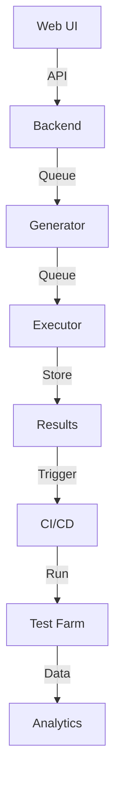
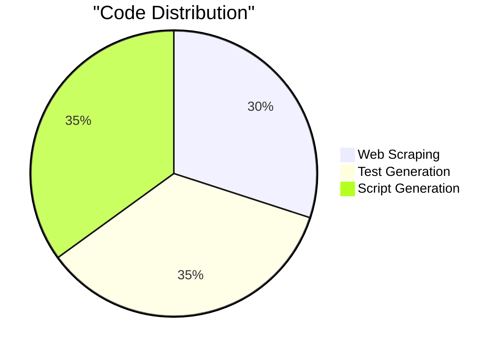

# AI-Driven Test Automation Framework 🤖


## 📋 Project Details
- **Submitted By**: srikrishnavansi
- **Submission Date**: 2025-04-01
- **Last Updated**: 2025-04-01 16:54:19 UTC

## 🎯 Project Overview

This project implements an AI-driven test automation framework that combines web scraping, AI-powered test case generation using Gemini, and automated Selenium script generation. The framework streamlines QA processes by automating test creation and maintenance.

### Key Features
- 🕷️ Automated web element extraction using BeautifulSoup4
- 🤖 AI-powered test case generation via Gemini & LangChain
- 📝 Automated Selenium script generation 
- 📊 Structured outputs (JSON/Excel)
- 🔄 Modular and extensible design

## 🏗️ System Architecture



## 📑 Implementation Details

### Task 1: Web Scraping


**Features:**
- BeautifulSoup4 for parsing
- Dynamic content handling
- Error handling & retries
- Structured JSON output
- Element attribute extraction

### Task 2: Test Generation


**Features:**
- Gemini AI integration
- LangChain workflows
- Structured prompts
- Response validation
- Excel formatting

### Task 3: Script Generation


**Features:**
- Page Object Model
- Error handling
- Logging
- Cross-browser support

## 🔧 Project Structure

```
ai_testing_automation/
│
├── src/
│   ├── task1_web_scraping/
│   │   ├── __init__.py
│   │   └── scraper.py
│   ├── task2_test_generation/
│   │   ├── __init__.py
│   │   └── test_case_generator.py
│   ├── task3_script_generation/
│   │   ├── __init__.py
│   │   └── selenium_script_generator.py
│   └── utils/
│       ├── __init__.py
│       └── config.py
│
├── output/
│   ├── elements.json
│   ├── test_cases.xlsx
│   └── test_scripts.xlsx
│
├── requirements.txt
└── README.md
```

## 🚀 Setup & Installation

1. **Clone Repository**
```bash
git clone https://github.com/srikrishnavansi/Ai_Automation.git
cd Ai_Automation
```

2. **Create Virtual Environment**
```bash
python -m venv venv
source venv/bin/activate  # Linux/Mac
.\venv\Scripts\activate   # Windows
```

3. **Install Dependencies**
```bash
pip install -r requirements.txt
```

4. **Configure Environment**
```bash
echo "GOOGLE_API_KEY=your_gemini_api_key_here" > .env
```

## 📖 Usage Instructions

1. **Run Web Scraper**
```bash
python src/task1_web_scraping/scraper.py
```

2. **Generate Test Cases**
```bash
python src/task2_test_generation/test_case_generator.py
```

3. **Generate Scripts**
```bash
python src/task3_script_generation/selenium_script_generator.py
```

## 🎯 Challenges & Solutions

| Challenge | Solution | Implementation |
|-----------|----------|----------------|
| Dynamic Content | Wait Mechanisms | Selenium WebDriverWait |
| JSON Parsing | Error Handling | Response Validation |
| Rate Limits | Retries | Exponential Backoff |
| Response Format | Prompt Engineering | JSON Templates |
| Code Structure | Design Patterns | Modular Architecture |
| Test Coverage | AI Analysis | Scenario Generation |

## 🔄 Future Improvements

### Technical Enhancements
- [ ] Parallel Execution
- [ ] Docker Support
- [ ] CI/CD Integration
- [ ] Cross-browser Testing
- [ ] Performance Testing
- [ ] API Testing Support

### AI Enhancements
- [ ] Self-healing Tests
- [ ] Smart Prioritization
- [ ] Auto-maintenance
- [ ] Result Analysis
- [ ] Coverage Optimization

### Architecture Vision


## ✅ Submission Checklist

### Required Files
- [x] Python Scripts
  - [x] scraper.py
  - [x] test_case_generator.py
  - [x] selenium_script_generator.py
  
- [x] Output Files
  - [x] elements.json
  - [x] test_cases.xlsx
  - [x] test_scripts.xlsx

### Documentation
- [x] README.md
  - [x] Overview
  - [x] Setup Guide
  - [x] Usage Steps
  - [x] Architecture
  - [x] Future Plans

### Code Quality
- [x] Type Hints
- [x] Error Handling
- [x] Logging
- [x] Comments
- [x] Tests

## 📚 Dependencies

```json
{
    "python": ">=3.8",
    "beautifulsoup4": "4.12.2",
    "requests": "2.31.0",
    "pandas": "2.1.4",
    "selenium": "4.16.0",
    "openpyxl": "3.1.2",
    "python-dotenv": "1.0.0",
    "langchain": ">=0.1.17",
    "langchain-google-genai": ">=0.0.4"
}
```

## 🤖 GenAI References

   - [GPT Link](https://chatgpt.com/share/67ec1fef-eb00-8011-a5df-fc87025ebb46) 


## 📊 Project Stats



## 📞 Contact

- **Name**: srikrishnavansi
- **GitHub**: [srikrishnavansi](https://github.com/srikrishnavansi)
- **Submission**: 2025-04-01 16:54:19 UTC

## 📝 License

This project is licensed under the MIT License - see the [LICENSE](LICENSE) file for details.
